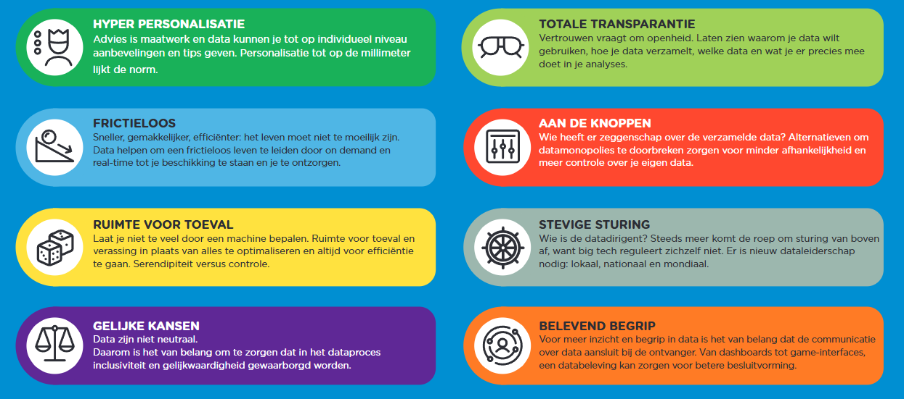
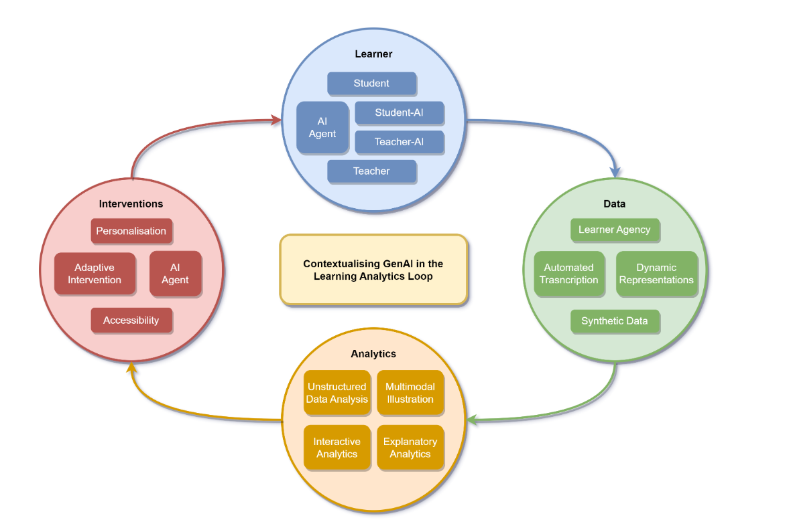
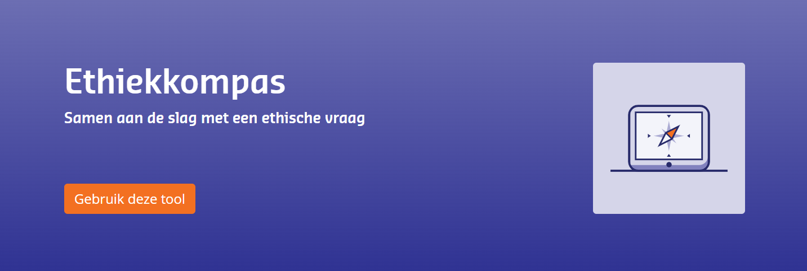
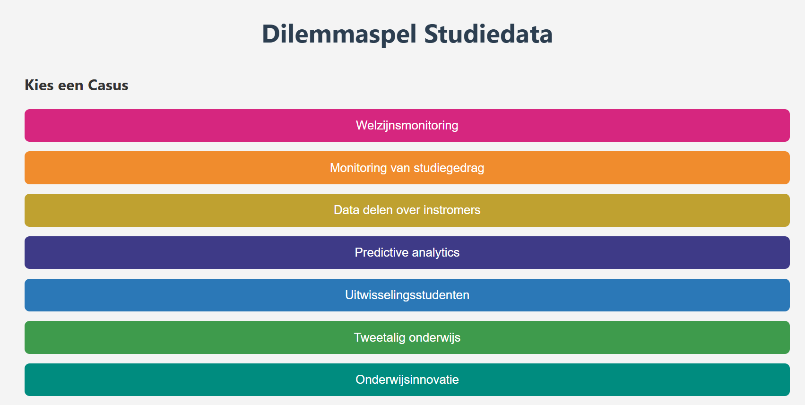
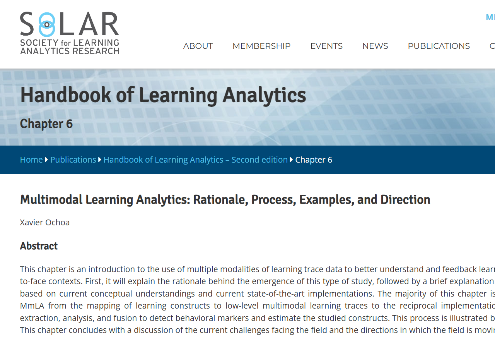
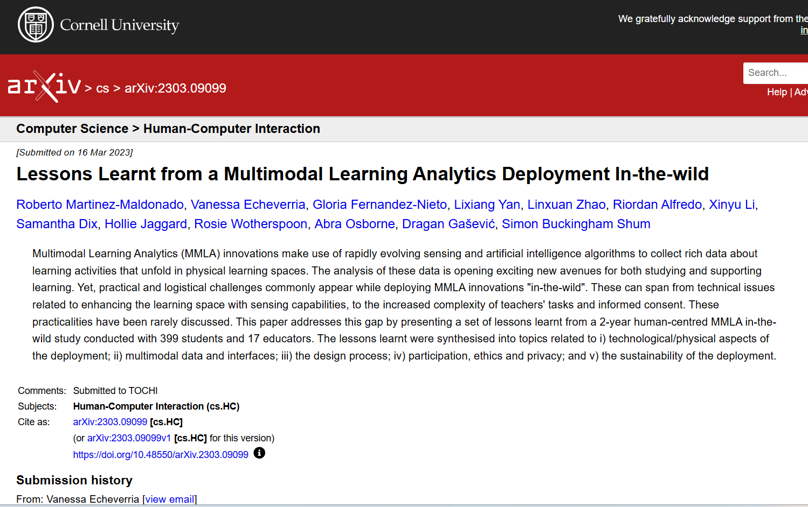

# Learning Analytics Bronnen (2025-2026)

Dit is een verzameling van aanvullende bronnen bij de sessies over Learning Analytics in jaar 1 van de HAN Master Ontwerpen van Eigentijds Leren (MOVEL). Zoals de naam al suggereert zijn de bronnen niet verplicht. Een groot deel van de bronnen richt zich op een specifieke onderwijssector (bijvoorbeeld hoger onderwijs of primair onderwijs). Als je als leraar/docent actief bent in een andere sector, kunnen deze tóch relevant en interessant voor je zijn. Veel uitdagingen die onderzocht worden zijn namelijk veel minder sectorspecifiek dan je zou denken.

De bronnen (en links) zijn voor het laatst bijgewerkt en gecontroleerd op **21 februari 2026**.

## Npuls: Magazines Learning Analytics

Npuls is een Nederlands innovatieprogramma voor het onderwijs, gefinancierd vanuit het Nationaal Groeifonds. Het initiatief richt zich op het toekomstbestendig maken van het mbo, hbo en wo door digitalisering, betere data-uitwisseling en flexibeler onderwijs. Binnen Npuls werken onderwijsinstellingen samen aan gedeelde infrastructuren en vernieuwende leeromgevingen.
De [website van Npuls](https://npuls.nl/) bevat heel veel nieuws en informatie. 
Voor hier drie publicaties van Npuls gericht op Learning Analytics. Met voorbeelden en veel leesmateriaal.

*   Berg, A., van Leeuwen, A., Slotboom, A., van der Pas, S., Pereira, P., & Valle Torre, M. (2024). *Op weg naar succes met Learning Analytics: Een overzicht van facilitators en barrières (Learning Analytics magazine I)*. Npuls. https://npuls.nl/kennisbank/learning-analytics-magazine [PDF](pdfs/Learning Analytics magazine.pdf)
*   Berg, A., Pereira, P., Slotboom-Memelink, A., Valle Torre, M., van der Pas, S., & van Leeuwen, A. (2024). *Studenten vooruit helpen met learning analytics: Praktijkverhalen, opbrengsten, uitdagingen en toekomstperspectief*. Npuls. https://npuls.nl/kennisbank/learning-analytics-magazine-ii [PDF](pdfs/Learning Analytics magazine II.pdf)
*  Berg, A. M., Pereira, P. D., Slotboom-Memelink, J. H., Valle Torre, M., van der Pas, S., & van Leeuwen, A. (2025). *Docenten vooruit helpen met learning analytics: Praktijkverhalen, voordelen, proces en externe factoren*. Npuls. https://npuls.nl/kennisbank/learning-analytics-magazine-iii [PDF](pdfs/Learning Analytics magazine III.pdf)

## SURF: Trendverkenning Studiedata

De trendverkenning is door SURF uitgevoerd in 2022, al wat ouder dus als het om een trendverkenning gaat maar het biedt interessante inzichten. Zeker ook als het om de vraag gaat "wat is er in 2026 nog niet uitgekomen?".

*   Akcaova, G., Baten, D., Poot, G., & Vermaas, K. (2022). *Trendverkenning studiedata: een exploratie van opkomende waarden & behoeften rondom studiedata*. https://www.surf.nl/8-maatschappelijke-trends-voor-studiedata [PDF](pdfs/surf-trendrapport_def_0.pdf)

## Het wiel van data science

Het [wiel van data science](https://doe-meer-met-studiedata.nl/article/het-wiel-van-data-science/) toont van binnen naar buiten en met de klok mee:
*   wat de hoofdactiviteiten zijn
*   welke onderliggende activiteiten van belang zijn,
*   welke capaciteiten er in een onderwijsorganisatie nodig zijn,
*   welke kernwaarden daarbij voorop staan.

## AI en Learning Analytics

De afbeelding hierboven beschrijft hoe kunstmatige intelligentie (AI) impact heeft op het proces van learning analytics. De afbeelding komt uit:
* Yan, K., Zhang, Y., Chen, Y., Drachsler, H., & Kalz, M. (2023). *Generative Artificial Intelligence in Learning Analytics: Contextualising opportunities and challenges through the Learning Analytics Cycle* [Preprint]. arXiv. https://arxiv.org/abs/2312.00087 [PDF](pdfs/Yan et al. - 2023 - Generative Artificial Intelligence in Learning Analytics.pdf)

## Ethiekkompas

De ethiekkompas is een online tool waarmee je als team het gesprek kunt ondersteunen als het gaat om ethische vraagstukken rond digitalisering op basis van waarden. Ontwikkeld door Kennisnet.
*  [Website van het Ethiekkompas](https://wijzer.kennisnet.nl/ethiekkompas)
  Online tool waarmee je als team het gesprek kunt ondersteunen als het gaat om ethiek en data.

**Aanvullende bronnen**
<!-- no-cards -->
*   [Waarden wegen - Een ethisch perspectief op digitalisering in het onderwijs](http://kn.nu/waardenwegen)
*   [Stappenplan Ethiekkompas – printversie](http://kn.nu/waardenwegen-stappenplan)
*   [Casussen – Drie uitwerkingen van ethische vragen die met behulp van het stappenplan beantwoord zijn](http://kn.nu/waardenwegen-casussen)
*   [Waardenwijzer](https://www.kennisnet.nl/tools/waardenwijzer/)

## Referentiekader privacy en ethiek voor studiedata

Referentiekader en dilemmaspel gericht op het hoger onderwijs en studiedata. Ontwikkeld door het Versnellingsplan.

*   Zone Veilig en Betrouwbaar Benutten van Studiedata. (2021). *Referentiekader privacy en ethiek voor studiedata (versie 1.0)*. Versnellingsplan Onderwijsinnovatie met ICT. [PDF](pdfs/Referentiekader-privacy-en-ethiek-voor-studiedata_versie-1.0.pdf)
*   [Online Dilemmaspel](https://ictoblog.com/html/Dilemmaspel/) Dit spel is niet ontwikkeld door het Versnellingsplan, maar maakt wel gebruik van het referentiekader voor de casussen.

**Andere ethiekspellen**
<!-- no-cards -->
*   [Fontys: Moral Design - the game](https://www.fontys.nl/Onderzoek/Moral-design-strategy/Moral-Design-the-game.htm)
*   [HvA: Ethiektoolkit](https://ethiektoolkit.nl/)
*   [Hogeschool Utrecht: Ethisch ontwerpspel](https://www.hu.nl/onderzoek/projecten/ethisch-ontwerpspel-ethics-inc)

## Ethische richtlijnen van de EU

Europa heeft ook richtlijnen online staan. 

*  Europese Commissie. (2022). *Ethische richtsnoeren voor het gebruik van artificiële intelligentie (AI) en data bij onderwijzen en leren voor onderwijsactoren*. Luxemburg: Bureau voor publicaties van de Europese Unie. https://op.europa.eu/nl/publication-detail/-/publication/d81a0d54-5348-11ed-92ed-01aa75ed71a1 [PDF](pdfs/ethische richtsnoeren voor het gebruik van artificiële intelligentie en data.pdf)

## AVG: Autoriteit Persoonsgegevens (AP)

De Autoriteit Persoonsgegevens (AP) is de onafhankelijke toezichthouder in Nederland die toezicht houdt op de naleving van de privacywetgeving, met name de Algemene verordening gegevensbescherming (AVG). De AP controleert of organisaties en overheden persoonsgegevens rechtmatig, transparant en veilig verwerken, behandelt klachten van burgers, kan onderzoeken instellen en handhavend optreden via waarschuwingen, bindende aanwijzingen en boetes. Daarnaast geeft de AP voorlichting en richtsnoeren over privacyrechten en gegevensbescherming, en adviseert zij over nieuwe wet- en regelgeving
Er is heel veel relevante info op hun website te vinden:
<!-- no-cards -->
*   [Privacyregels voor scholen](https://www.autoriteitpersoonsgegevens.nl/themas/onderwijs/gebruik-van-persoonsgegevens-in-het-onderwijs/privacyregels-voor-scholen)
*   [Verantwoordingsplicht](https://www.autoriteitpersoonsgegevens.nl/themas/basis-avg/avg-algemeen/verantwoordingsplicht)
*   [DPIA](https://www.autoriteitpersoonsgegevens.nl/themas/basis-avg/praktisch-avg/data-protection-impact-assessment-dpia)
*   [Beeldmateriaal in het onderwijs](https://www.autoriteitpersoonsgegevens.nl/themas/internet-slimme-apparaten/beeldmateriaal/beeldmateriaal-in-het-onderwijs)
*   [Verantwoordelijke en verwerker](https://www.autoriteitpersoonsgegevens.nl/themas/basis-avg/avg-algemeen/verantwoordelijke-en-verwerker)
*   [Risico's algoritmes en AI in het onderwijs](https://www.autoriteitpersoonsgegevens.nl/themas/algoritmes-ai/risicos-algoritmes-ai-ontwikkelingen-in-nederland/risicos-algoritmes-en-ai-in-het-onderwijs) + [Rapportage AI- & Algoritmerisico's Nederland (RAN) - najaar 2023](https://www.autoriteitpersoonsgegevens.nl/documenten/rapportage-ai-algoritmerisicos-nederland-ran-najaar-2023)
*   [Leerlingdossier](https://www.autoriteitpersoonsgegevens.nl/themas/onderwijs/gebruik-van-persoonsgegevens-in-het-onderwijs/leerlingdossier)
*   [Digitale sytemen en hulpmiddelen](https://www.autoriteitpersoonsgegevens.nl/themas/onderwijs/gebruik-van-persoonsgegevens-in-het-onderwijs/digitale-systemen-en-hulpmiddelen)
*   [AP: onderwijs mag sociale media alleen inzetten met duidelijke afspraken](https://www.autoriteitpersoonsgegevens.nl/actueel/ap-onderwijs-mag-sociale-media-alleen-inzetten-met-duidelijke-afspraken)
*   [AP ziet grote uitdagingen voor onderwijs](https://www.autoriteitpersoonsgegevens.nl/actueel/ap-ziet-grote-uitdagingen-voor-onderwijs)
*   [Sectorbeeld Onderwijs 2021-2023](https://www.autoriteitpersoonsgegevens.nl/documenten/sectorbeeld-onderwijs-2021-2023)

## SURF: Learning Analytics in 5 stappen
Nog een document van SURF, ook deze al wat ouder, uit 2019, nog van voor alle AI wetgeving.
* SURF. (2019). Learning analytics in 5 stappen: Een handreiking voor de AVG. SURF. https://pec.surf.nl/learning-analytics/ [PDF](pdfs/Learning analytics in 5 stappen.pdf)

## AI Wetgeving
De bronnen gaan over learning analytics, maar omdat AI ook bij learning analytics een rol speelt, toch een overzicht van verschillende bronnen hierover:
<!-- no-cards -->
*   [Toelichting bij Kennisnet over de AI-verordening of AI-act](https://www.kennisnet.nl/artificial-intelligence/voldoen-aan-de-ai-verordening/)
*   [Inleiding en uitleg bij Npuls over de AI-verordening](https://npuls.nl/kennisbank/ai-act-inleiding-en-uitleg-over-de-ai-verordening/)
*   [Uitleg bij Digitale Overheid over AI-act](https://www.digitaleoverheid.nl/overzicht-van-alle-onderwerpen/nieuwe-technologieen-data-en-ethiek/artificiele-intelligentie-ai/ai-verordening/)

## Multimodale Learning Analytics

Een paar interessante bronnen op het gebied van multimodale learning analytics:

*    Ochoa, X. (2022). *Multimodal learning analytics: Rationale, process, examples, and direction*. In C. Lang, G. Siemens, A. F. Wise, D. Gašević, & A. Merceron (Eds.), *The handbook of learning analytics* (2e ed., pp. 54–65). SoLAR. https://www.solaresearch.org/publications/hla-22/hla22-chapter6/ [PDF](pdfs/HLA22_Chapter_6_Ochoa.pdf)

*    Martinez-Maldonado, R., Echeverria, V., Fernandez-Nieto, G., Yan, L., Zhao, L., Alfredo, R., Li, X., Dix, S., Jaggard, H., Wotherspoon, R., Osborne, A., Gašević, D., & Buckingham Shum, S. (2023). *Lessons learnt from a multimodal learning analytics deployment in-the-wild*. arXiv. https://doi.org/10.48550/arXiv.2303.09099 [PDF](pdfs/2303.09099v1.pdf)

## Wetenschappelijk onderzoek

Hieronder vind je een overzicht van ander relevant onderzoek op het gebied van learning analytics, voorzien van een korte beschrijving.

*   AlZoubi, D., & Baran, E. (2024). *A Closer Look at Instructor Use and Sensemaking Processes of Analytics Dashboards*. Journal of Learning Analytics, 1–22. https://doi.org/10.18608/jla.2023.7961 [PDF](pdfs/Alzoubi,%20Baran%20-%202024%20-%20A%20Closer%20Look%20at%20Instructor%20Use%20and%20Sensemaking%20Processes%20of%20Analytics%20Dashboards%20Past%20,%20Present%20,%20and%20Future.pdf)
    *   Onderzoek naar hoe docenten dashboards gebruiken voor sensemaking en de impact op hun lesgeven.
*   Cijvat, C. C., Denessen, E., Sleegers, P. J. C., Van der Graaf, J., & Molenaar, I. (2023). *Wat leraren doen: de inzet van adaptieve leermiddelen in het basisonderwijs*. Pedagogische Studiën, 100(1), 1–34. https://doi.org/10.59302/ps.v100i1.13989 [PDF](pdfs/Cijvat%20et%20al.%20-%202023%20-%20Wat%20leraren%20doen%20de%20inzet%20van%20adaptieve%20leermiddelen%20in%20het%20basisonderwijs(2).pdf)
    *   Studie naar hoe leraren adaptieve leermiddelen combineren met adaptief lesgeven in het basisonderwijs.
*   Clarke, D., & Hollingsworth, H. (2002). *Elaborating a model of teacher professional growth*. Teaching and Teacher Education, 18(8), 947–967. https://doi.org/10.1016/s0742-051x(02)00053-7 [PDF](pdfs/Clarke,%20Hollingsworth%20-%202002%20-%20Elaborating%20a%20model%20of%20teacher%20professional%20growth.pdf)
    *   Een model voor professionele groei van leraren, gebaseerd op empirische data.
*   Holstein, K., McLaren, B. M., & Aleven, V. (2017). *Intelligent tutors as teachers’ aides*. Proceedings of the Seventh International Learning Analytics &amp; Knowledge Conference, 257–266. https://doi.org/10.1145/3027385.3027451 [PDF](pdfs/Holstein,%20Mclaren,%20Aleven%20-%202017%20-%20Intelligent%20Tutors%20as%20Teachers%20%E2%80%99%20Aides%20Exploring%20Teacher%20Needs%20for%20real-time%20Analytics%20in%20Blended%20Cl.pdf)
    *   Verkenning van lerarenbehoeften voor real-time analytics in blended classrooms (vergelijkbaar met hierboven).
*   Van Kessel, M., Molenaar, I., Knoop-van Campen, C. A. N., De Jonge, M., & Saab, N. (2025). *Primary School Teacher Perspectives on Effective Dashboard Use in the Classroom*. Journal of Learning Analytics, 12(2), 279–292. https://doi.org/10.18608/jla.2025.8493 [PDF](pdfs/Kessel%20et%20al.%20-%202025%20-%20Primary%20School%20Teacher%20Perspectives%20on%20Effective%20Dashboard%20Use%20in%20the%20Classroom%20Skills%20,%20Knowledge%20,%20and%20Context.pdf)
    *   Perspectieven van basisschoolleraren op effectief dashboardgebruik: benodigde vaardigheden, kennis en context.
*   Keuning, T., & van Geel, M. (2021). *Differentiated Teaching With Adaptive Learning Systems and Teacher Dashboards: The Teacher Still Matters Most*. IEEE Transactions on Learning Technologies, 14(2), 201–210. https://doi.org/10.1109/tlt.2021.3072143 [PDF](pdfs/Keuning%20and%20Van%20Geel%20-%202021%20-%20Differentiated%20Teaching%20With%20Adaptive%20Learning%20Systems%20and%20Teacher%20Dashboards%20The%20Teacher%20Still%20Mat.pdf)
    *   Cognitieve taakanalyse van de vaardigheden die leraren nodig hebben voor differentiatie met adaptieve leersystemen.
*   Lee, J., Alonzo, D., Beswick, K., Abril, J. M. V., Chew, A. W., & Oo, C. Z. (2024). *Dimensions of teachers’ data literacy: A systematic review of literature from 1990 to 2021*. Educational Assessment, Evaluation and Accountability, 36(2), 145–200. https://doi.org/10.1007/s11092-024-09435-8 [PDF](pdfs/Lee%20et%20al.%20-%202024%20-%20Dimensions%20of%20teachers%20%E2%80%99%20data%20literacy%20A%20systematic%20review%20of%20literature%20from%201990%20to%202021.pdf)
    *   Systematische review van literatuur over data-geletterdheid van leraren (1990-2021).
*   van Leeuwen, A., & Rummel, N. (2020). *Comparing teachers’ use of mirroring and advising dashboards*. Proceedings of the Tenth International Conference on Learning Analytics &amp; Knowledge, 26–34. https://doi.org/10.1145/3375462.3375471 [PDF](pdfs/Leeuwen%20-%202020%20-%20Comparing%20Teachers%20%E2%80%99%20Use%20of%20Mirroring%20and%20Advising%20Dashboards.pdf)
    *   Vergelijking van 'mirroring' en 'advising' dashboards en hun effect op hoe leraren problemen signaleren.
*   Metsäpelto, R.-L., Poikkeus, A.-M., Heikkilä, M., Heikkinen-Jokilahti, K., Husu, J., Laine, A., Lappalainen, K., Lähteenmäki, M., Mikkilä-Erdmann, M., & Warinowski, A. (2020). *Conceptual Framework of Teaching Quality: A Multidimensional Adapted Process Model of Teaching*. https://doi.org/10.31234/osf.io/52tcv [PDF](pdfs/Metsapelto%20et%20al.%20-%202021%20-%20A%20multidimensional%20adapted%20process%20model%20of%20teaching.pdf)
    *   Een multidimensionaal procesmodel van lesgeven (MAP), gebaseerd op een review van literatuur.
*   Michaeli, S., Kroparo, D., & Hershkovitz, A. (2020). *Teachers’ Use of Education Dashboards and Professional Growth*. The International Review of Research in Open and Distributed Learning, 21(4), 61–78. https://doi.org/10.19173/irrodl.v21i4.4663 [PDF](pdfs/Michaeli%20et%20al.%20-%202020%20-%20Teachers%E2%80%99%20Use%20of%20Education%20Dashboards%20and%20Professional%20Growth.pdf)
    *   Onderzoek naar de relatie tussen het gebruik van dashboards en de professionele groei van leraren.
*   Molenaar, I., & Knoop-van Campen, C. A. N. (2019). *How Teachers Make Dashboard Information Actionable*. IEEE Transactions on Learning Technologies, 12(3), 347–355. https://doi.org/10.1109/tlt.2018.2851585 [PDF](pdfs/Molenaar%20and%20Knoop-van%20Campen%20-%202019%20-%20How%20Teachers%20Make%20Dashboard%20Information%20Actionable.pdf)
    *   Hoe leraren informatie van dashboards omzetten in acties in de klas.
*   Uysal, M., & Horzum, M. B. (2021). *Designing and Developing a Learning Analytics Dashboard to Support Self-Regulated Learning*. Visualizations and Dashboards for Learning Analytics, 477–496. https://doi.org/10.1007/978-3-030-81222-5_22 [PDF](pdfs/Molenaar%20et%20al.%20-%202019%20-%20Designing%20Dashboards%20to%20support%20learners'%20Self-Regulated%20Learning(2).pdf)
    *   Over het ontwerpen van dashboards ter ondersteuning van zelfregulerend leren.
*   Poquet, O. (2024). *A shared lens around sensemaking in learning analytics: What activity theory, definition of a situation and affordances can offer.* British Journal of Educational Technology, 55(4), 1811–1831. Portico. https://doi.org/10.1111/bjet.13435 [PDF](pdfs/Poquet%20-%202024%20-%20A%20shared%20lens%20around%20sensemaking%20in%20learning%20analytics%20What%20activity%20theory,%20definition%20of%20a%20situation%20and%20affordances%20c.pdf)
    *   Een theoretisch kader (Activity Theory) voor sensemaking in learning analytics.
*   Schwendimann, B. A., Rodriguez-Triana, M. J., Vozniuk, A., Prieto, L. P., Boroujeni, M. S., Holzer, A., Gillet, D., & Dillenbourg, P. (2017). *Perceiving Learning at a Glance: A Systematic Literature Review of Learning Dashboard Research.* IEEE Transactions on Learning Technologies, 10(1), 30–41. https://doi.org/10.1109/tlt.2016.2599522 [PDF](pdfs/Schwendimann%20et%20al.%20-%202017%20-%20Perceiving%20Learning%20at%20a%20Glance%20A%20Systematic%20Literature%20Review%20of%20Learning%20Dashboard%20Research.pdf)
    *   Systematische literatuurreview over onderzoek naar learning dashboards.
*   van Leeuwen, A., & Rummel, N. (2020). *Comparing teachers’ use of mirroring and advising dashboards*. Proceedings of the Tenth International Conference on Learning Analytics &amp; Knowledge, 26–34. https://doi.org/10.1145/3375462.3375471 [PDF](pdfs/Van%20Leeuwen%20and%20Rummel%20-%202020%20-%20Comparing%20teachers'%20use%20of%20mirroring%20and%20advising%20dashboards.pdf)
    *   Vergelijking van 'mirroring' en 'advising' dashboards.
*   van Leeuwen, A., Knoop-van Campen, C. A. N., Molenaar, I., & Rummel, N. (2021). *How Teacher Characteristics Relate to How Teachers Use Dashboards: Results From Two Case Studies in K-12*. Journal of Learning Analytics, 8(2), 6–21. https://doi.org/10.18608/jla.2021.7325 [PDF](pdfs/Van%20Leeuwen%20et%20al.%20-%202021%20-%20How%20Teacher%20Characteristics%20Relate%20to%20How%20Teachers%20Use%20Dashboards%20Results%20From%20Two%20Case%20Studies%20in.pdf)
    *   Twee casestudies naar de relatie tussen lerarenkenmerken en dashboardgebruik.
*   Vick, J., Uribe-Flórez, L., Trespalacios, J., & Ching, Y. (2025). *Exploring Elementary Teachers’ Confidence and Anxiety in Data-Based Decision-Making.* TechTrends, 69(6), 1288–1303. https://doi.org/10.1007/s11528-025-01113-w [PDF](pdfs/Vick%20et%20al.%20-%202025%20-%20Exploring%20Elementary%20Teachers'%20Confidence%20and%20Anxiety%20in%20Data-Based%20Decision-Making.pdf)
    *   Onderzoek naar het zelfvertrouwen en de angst van basisschoolleraren bij datagestuurde besluitvorming.
*   Wang, F., Zhou, X., Li, K., Cheung, A. C. K., & Tian, M. (2025). *The effects of artificial intelligence-based interactive scaffolding on secondary students’ speaking performance, goal setting, self-evaluation, and motivation in informal digital learning of English*. Interactive Learning Environments, 33(7), 4633–4652. https://doi.org/10.1080/10494820.2025.2470319 [PDF](pdfs/Wang%20et%20al.%20-%202025%20-%20The%20effects%20of%20artificial%20intelligence-based%20interactive%20scaffolding%20on%20secondary%20students%20%E2%80%99%20speaking%20performance%20,.pdf)
    *   Effecten van AI-scaffolding op spreekvaardigheid, doelen stellen en motivatie bij Engels leren.
*   Witte, A. L., Knoche, L. L., Sheridan, S. M., & Koziol, N. (2023). *How Teachers Use Data: Description and Differences Across PreK Through Third Grade.* Early Childhood Education Journal, 53(2), 437–446. https://doi.org/10.1007/s10643-023-01588-3 [PDF](pdfs/Witte%20et%20al.%20-%202025%20-%20How%20Teachers%20Use%20Data%20Description%20and%20Differences%20Across%20PreK%20Through%20Third%20Grade.pdf)
    *   Beschrijving van datagebruik door leraren van kleuter- tot groep 5.
*   Mandinach, E. B., & Abrams, L. M. (2022). *Data Literacy and Learning Analytics*. The Handbook of Learning Analytics, 196–204. https://doi.org/10.18608/hla22.019 [PDF](pdfs/Wolff%20et%20al.%20-%202016%20-%20Data%20literacy%20for%20learning%20analytics.pdf)
    *   Workshop over data-geletterdheid voor learning analytics en het belang ervan voor gebruikers.
*   Masiello, I., Mohseni, Z., Palma, F., Nordmark, S., Augustsson, H., & Rundquist, R. (2024). *A Current Overview of the Use of Learning Analytics Dashboards*. Education Sciences, 14(1), 82. https://doi.org/10.3390/educsci14010082 [PDF](pdfs/education-14-00082.pdf)
*   van Kessel, M., Molenaar, I., Knoop-van Campen, C. A. N., de Jonge, M., & Saab, N. (2025). *Primary School Teacher Perspectives on Effective Dashboard Use in the Classroom: Skills, Knowledge, and Contextual Conditions.* Journal of Learning Analytics, 1-14. https://doi.org/10.18608/jla.2025.8493 [PDF](pdfs/8493-Article Text-44501-2-10-20250830.pdf)
*   Banihashem, Seyyed Kazem & Macfadyen, Leah. (2021). *Pedagogical Design: Bridging Learning Theory and Learning Analytics*. Canadian Journal of Learning and Technology. https://www.researchgate.net/publication/353807723_Pedagogical_Design_Bridging_Learning_Theory_and_Learning_Analytics [PDF](pdfs/27959-ArticleText-73877-1-10-20210806.pdf)
